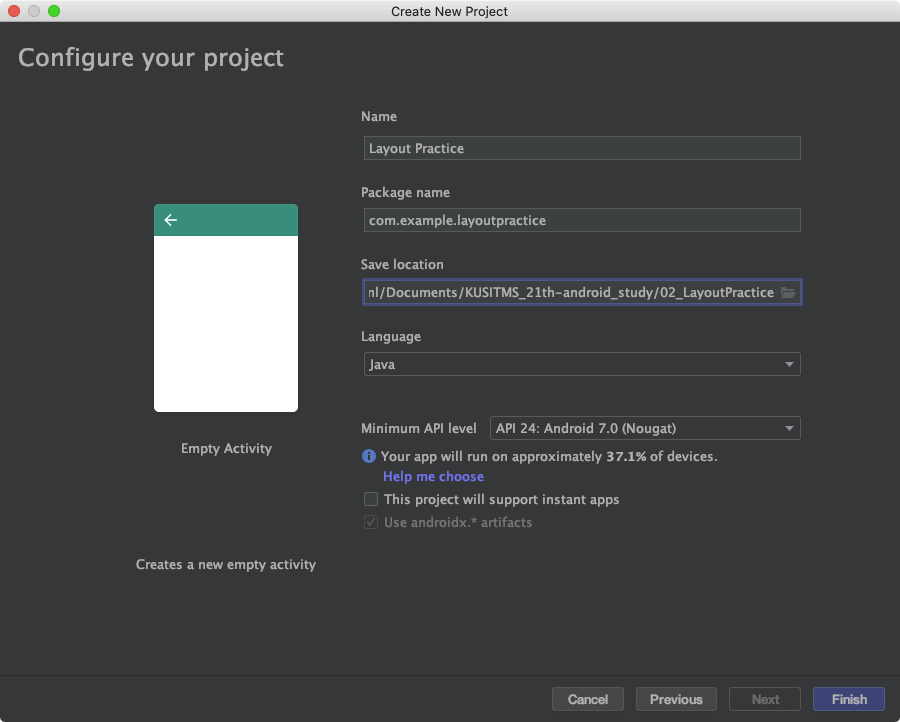
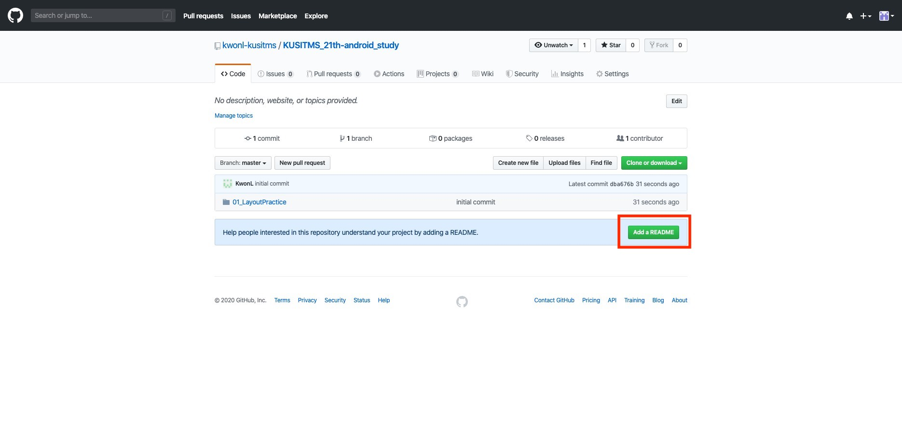
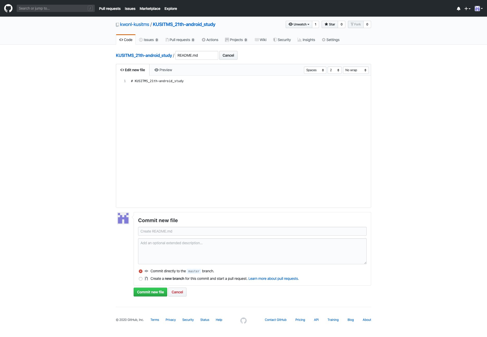
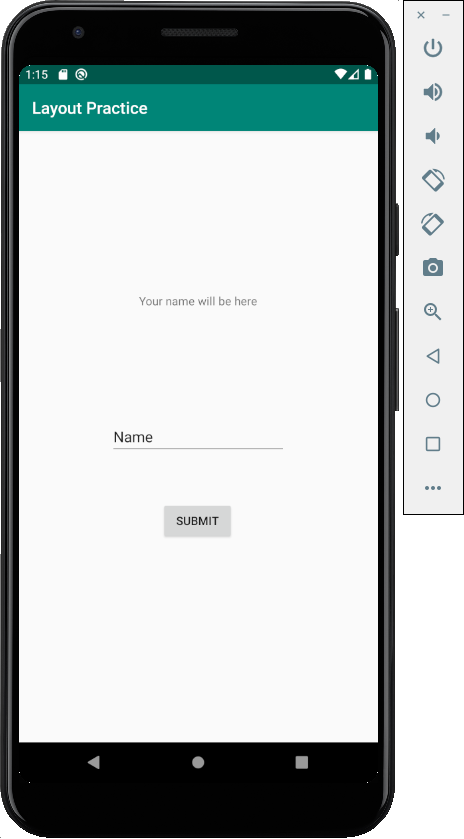
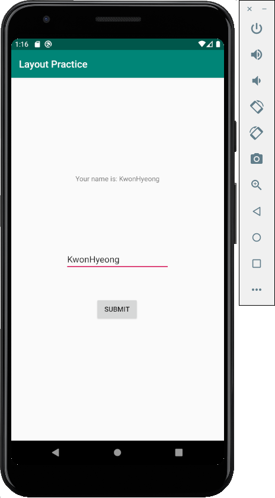
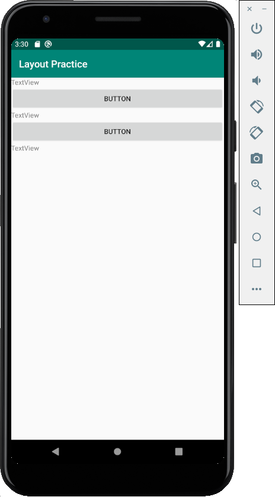
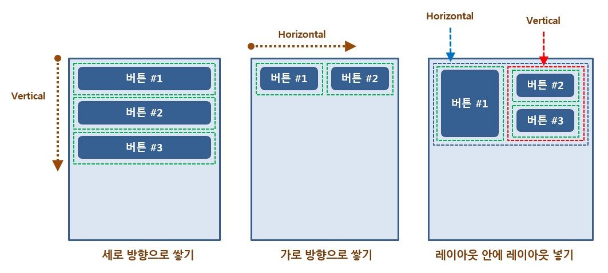
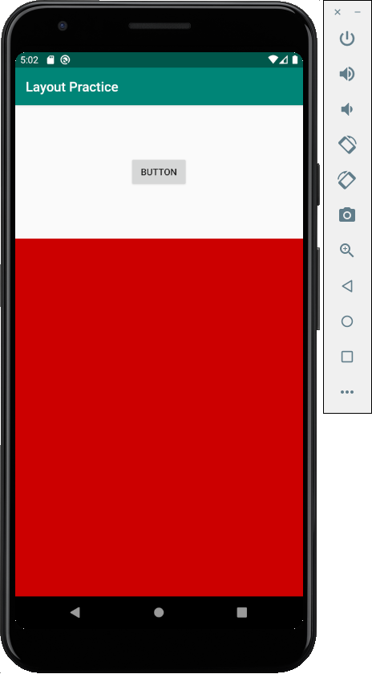
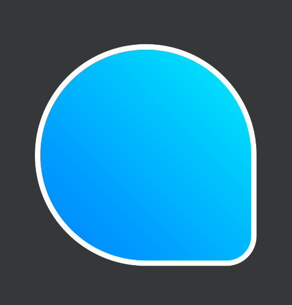

# 안드로이드 - REST API 스터디 2주차
이번 주에는 안드로이드의 view와 layout, fragment에 대해 배워봅시다.

## 복습
들어가기 전에, 저번 시간에 했던 것을 복습해보면서 제대로 된 project setting을 해봅시다. 우리는 앞으로 새로운 것을 만들 때마다 새로운 안드로이드 프로젝트를 만들 건데, 이것을 하나의 git repository에 저장해둡시다.

이름이 **KUSITMS_21th-android_study** 폴더를 만들어 줍시다. 위치는 어디든 상관 없습니다. 저는 **/Users/kwonl/Documents**에 만들겠습니다! 앞으로 만들 안드로이드 프로젝트들은 위치를 이곳으로 지정해주세요!

### 안드로이드
다음과 같이 프로젝트를 생성해줍시다. 필요한 것은 이전 시간에 다 깔아놨으니, 초기 빌드가 오래걸리지는 않을 거에요!



### git
다음은 우리의 git project를 셋팅해줘야겠죠? 다음과 같이 **KUSITMS_21th-android_study** 라는 이름의 repository를 생성해줍시다.


됐으면 이제, **KUSITMS_21th-android_study**를 만든 위치로 가서 git bash를 실행해주세요! 윈도우의 경우, 우클릭 후 git bash here를 실행하시면 됩니다.

이제 다음의 command를 통해 첫 commit을 작성하고 push를 해줍시다.

```bash
# {{ 변수 }} 이렇게 것은, {{ 변수 }} 대신에 변수를 입력하라는 뜻입니다!
git init
git remote add origin "{{ github repository URL }}"
git add *   # Add all unstaged files. *은 wildcard라고 해서, 모든 파일을 의미합니다(숨김 파일 제외)
git commit -m "initial commit"
git push --set-upstream origin master   # Upstream, 즉 지금 branch의 remote branch를 설정하라는 의미로, 다음부터는 그냥 git push만 실행해도 됩니다.
```



프로젝트가 위와 같이 설정되었는데, 잘 보면 README를 추가하라고 나와있죠? README.md는 markdown이라는 언어(언어? 음 html?)로 작성된 문서를 말하는데, 작성이 쉽고 간결해서 문서를 코딩 관련 문서를 작성할 때 많이 사용됩니다. README.md는 프로젝트의 설명을 쓰는 문서라고 생각합시다. 빨간 버튼을 눌러봅시다!



일단 위와 같이 나오는데, # 은 제목을 설정하는 것입니다. README.md를 만들어줍시다.

그런데, remote repository(원격 저장소)에서 변경된 내용이 생겼는데, 우리의 local repository는 이걸 모르죠? 따라서 이걸 업데이트하는 과정을 거쳐야 합니다. 다음의 command를 입력하세요!

```bash
# git에서는 원격으로 업데이트하는 것을 push, 원격을 로컬로 가져오는 것을 pull이라 합니다.
git pull origin master
```

그러면 우리의 local repository에 README.md 가 추가된 것을 확인할 수 있습니다. 와우!

## 프론트엔드와 백엔드
이전에 말했 듯이, 안드로이드 앱은 할 때는 프론트와 백엔드를 나눌 수 있습니다. 프론트는 사용자의 화면에 비춰지는 부분을 구성하는 것이고, 백엔드는 뒤에서의 동작을 바꾸는가 것을 구성하는 것이죠. 예를 들어보면 편하죠. 다음과 같은 앱이 있다고 생각해봅시다.



위 앱은 Name이라는 곳에 우리의 이름을 입력하고 버튼을 클릭하면 다음과 같이 이름을 출력해주는 간단한 앱입니다. 다음과 같이요!



정말 간단하죠? 이때, 우리가 보는화면..즉, 버튼이나 텍스트 등을 구성하는 코드가 프론트엔드입니다. 그리고 버튼을 누르면 이름을 가져와서 위에다가 셋팅해주는 과정을 해주는 것이 백엔드이죠!

프론트엔드는 xml 코드로 이뤄져있으며, 백엔드는 java로 이뤄져 있습니다. 각각의 코드를 보면 다음과 같습니다.


```xml
<!-- 위 화면의 frontend -->
<?xml version="1.0" encoding="utf-8"?>
<androidx.constraintlayout.widget.ConstraintLayout xmlns:android="http://schemas.android.com/apk/res/android"
    xmlns:app="http://schemas.android.com/apk/res-auto"
    xmlns:tools="http://schemas.android.com/tools"
    android:layout_width="match_parent"
    android:layout_height="match_parent"
    tools:context=".MainActivity" >

    <EditText
        android:id="@+id/nameInput"
        android:layout_width="wrap_content"
        android:layout_height="wrap_content"
        android:ems="10"
        android:inputType="textPersonName"
        android:text="Name"
        app:layout_constraintBottom_toBottomOf="parent"
        app:layout_constraintEnd_toEndOf="parent"
        app:layout_constraintStart_toStartOf="parent"
        app:layout_constraintTop_toTopOf="parent" />

    <Button
        android:id="@+id/submitButton"
        android:layout_width="wrap_content"
        android:layout_height="wrap_content"
        android:text="Submit"
        app:layout_constraintBottom_toBottomOf="parent"
        app:layout_constraintEnd_toEndOf="parent"
        app:layout_constraintHorizontal_bias="0.498"
        app:layout_constraintStart_toStartOf="parent"
        app:layout_constraintTop_toBottomOf="@+id/nameInput"
        app:layout_constraintVertical_bias="0.183" />

    <TextView
        android:id="@+id/textView"
        android:layout_width="wrap_content"
        android:layout_height="wrap_content"
        android:layout_marginTop="64dp"
        android:text="Your name will be here"
        app:layout_constraintBottom_toTopOf="@+id/nameInput"
        app:layout_constraintEnd_toEndOf="parent"
        app:layout_constraintStart_toStartOf="parent"
        app:layout_constraintTop_toTopOf="parent" />
</androidx.constraintlayout.widget.ConstraintLayout>
```

```java
/* 위 화면의 backend */

package com.example.layoutpractice;

import androidx.appcompat.app.AppCompatActivity;

import android.os.Bundle;
import android.view.View;
import android.widget.Button;
import android.widget.EditText;
import android.widget.TextView;

public class MainActivity extends AppCompatActivity {

    @Override
    protected void onCreate(Bundle savedInstanceState) {
        super.onCreate(savedInstanceState);
        setContentView(R.layout.activity_main);

        Button submitButton = findViewById(R.id.submitButton);
        submitButton.setOnClickListener(new Button.OnClickListener() {
            @Override
            public void onClick(View view) {
                EditText nameInput = findViewById(R.id.nameInput);
                String name = nameInput.getText().toString();

                TextView textView = findViewById(R.id.textView);
                textView.setText("Your name is: " + name);
            }
        });
    }
}
```

우리는 오늘 frontend를 마스터(?) 해볼 겁니다!!

## View
안드로이드의 프론트엔드는 view로 이루어져 있습니다. view란 무엇인가? 안드로이드의 화면을 구성하는 기본 component라고 생각하시면 편합니다! 예를 들어 HTML을 생각해보면, HTML에는 여러가지 태그가 있고, 이 태그가 구성되어 화면을 이루게 되죠? 안드로이드에서도 똑같이, 여러 종류의 view가 있고 이것들이 모여서 화면을 구성하게 됩니다. 다음 그림을 보시면 이해가 편합니다.


> 출처: 네이버 부스트코스 안드로이드 강좌

기본적으로 View는 내부에 View를 포함할 수 있습니다. 이렇게 View가 모이게 된 것을 ViewGroup이라고 하고, Layout을 통해 View를 배치할 수도 있죠. OOP를 배워보신 분이라면 상속이라는 개념에 익숙하실텐데, 우리가 사용하는 View에는 여러가지 종류가 있지만, Layout, ViewGroup 등도 View를 상속하게 됩니다. 간단히 말해서, HTML의 태그와 같다고 생각하시면 돼요! HTML에서도 `div` 태그 안에 여러가지 태그가 포함될 수 있고, `p`태그 안에도 다른 태그가 포함될 수 있고.. xml 코드로 보시면 view의 크기는 `_width`, `_height`로 정의됨을 알 수 있습니다.


## Layout
Layout에 따라서 그 안의 view가 어떻게 배치되는지 결정이 됩니다. 따라서 상황에 따른 Layout을 적절히 사용하는 것이 중요하겠죠? 한번 알아보도록 합시다!

### Constraint Layout
우리가 기본적으로 Hello world project를 만들면 생성되는 layout입니다. constraint layout은 제약선(constraint)를 이용하여 view의 배치를 결정합니다. 참 쉽죠? constraint는 상하좌우 4방향으로 뻗어있으며, 반드시 4방향이 모두 연결되어 있어야 합니다. 그래야 view의 위치를 잡을 수 있기 때문이죠!

그리고 각각의 constraint는 다른 view에 붙어서 자신의 위치를 결정합니다. 이 때 다른 view는 parent(자신을 감싸고 있는 view)일 수도 있고, 근처에 위치한 다른 sibling view일 수도 있습니다.

위의 예제를 보면, nameInput view는 parent(Layout)에 붙어있고, bias도 모두 0이며 constraint 길이도 0이기 때문에 가운데로 고정이 되겠죠? 즉, constraint layout에서는 view의 위치를 결정짓는 것이 constraint의 길이와 bias 두 가지입니다. 보통은 디자이너가 px단위로 작업해서 넘어주기 때문에, bias보다는 constraint의 길이를 통해 결정짓는 것같기는 합니다.

### Linear Layout
Linear Layout을 실습하기 위해, 다음과 같이 새 layout을 만들어봅시다.

1. 왼쪽의 디렉토리 구조에서, `res/layout`에 좌클릭 후, `New -> Layout resource file` 클릭
2. file name은 activity_linear, Root element를 LinearLayout으로 설정
3. 이후의 모든 창에 ok를 클릭!

Linear layout이 생성되었습니다. 언뜻 보기에는 Constraint layout과 차이가 없어보이죠? 여기에 textView를 여러개 끌어다 봅시다. 그러면 다음과 같이 element가 정렬되는 것을 확인할 수 있습니다.



그런데, 여러분은 에뮬레이터를 실행시켜도 아직 이전의 Hello world!가 떠있을 겁니다. layout이 반영이 안된걸까요?

안드로이드는 frontend와 backend로 이뤄져있다고 했습니다. xml파일을 만들었으면, 이 frontend를 backend에 연결을 해줘야겠죠? 안드로이드에서는 저렇게 한번에 보여지는 전체 화면을 **Activity**라고 하는데, 이 activity는 java코드로 결정을 합니다. 이 activity에서 어떤 xml을 사용할지는 코드에서 지정해줘야겠죠? MainActivity.java에 들어가서, 다음 부분을 수정해줍시다.

```java
@Override
protected void onCreate(Bundle savedInstanceState) {
    super.onCreate(savedInstanceState);
    setContentView(R.layout.activity_main);
}

// 위 부분을 다음과 같이 바꿔줍시다.
@Override
protected void onCreate(Bundle savedInstanceState) {
    super.onCreate(savedInstanceState);
    setContentView(R.layout.activity_linear);
}
```

설명을 간단히 하자면, 이 activity의 frontend를 activity_linear이라는 xml파일로 사용하겠다는 의미입니다. 이제 다시 실행하면, 우리가 만든 linear layout이 표시가 될겁니다.


> 출처: 네이버 부스트코스 안드로이드 강좌

Linear layout은 말 그대로, 선형적으로 구성됩니다. 위 그림과 같이 가로, 세로 방향으로 쌓을 수도 있고, 레이아웃 안에 레이아웃을 넣어 배치를 할 수도 있습니다.

각각의 view의 크기는 match_parent, wrap_content, 절대 크기(px, dp 단위)로 결정할 수 있으며, view는 padding, boarder, margin을 가집니다(HTML과 같네요! 와우!).

주로 게시판과 같이 반복되는 view들이 나열될 때 사용하도록 합니다.

### Relative Layout
다음은 Relative layout을 알아보도록 합시다. 만드는 과정은 Linear layout과 같습니다.

1. 왼쪽의 디렉토리 구조에서, `res/layout`에 좌클릭 후, `New -> Layout resource file` 클릭
2. file name은 **activity_relative**, Root element를 **RelativeLayout**으로 설정
3. 이후의 모든 창에 ok를 클릭!

그러면 다시 java코드로 가서 어떤 xml파일을 사용할 것인지 바꿔줘야겠죠? `setContentView(R.layout.activity_linear);` 를 `setContentView(R.layout.activity_relative);`로 바꿔줍시다. 그러면 에뮬레이터로 실행했을 때, relative layout을 적용할 수 있습니다.

Relative Layout에서는 모든 view들이 상대적으로 위치가 결정됩니다. 각각의 view의 크기는 마찬가지로 match_parent, wrap_content, 절대 크기(px, dp 단위)로 결정할 수 있습니다. relative layout에서는 xml 코드를 보면서 이해하는 것이 편합니다.

```xml
<!-- Relative layout example -->
<?xml version="1.0" encoding="utf-8"?>
<RelativeLayout xmlns:android="http://schemas.android.com/apk/res/android"
    android:layout_width="match_parent" android:layout_height="match_parent">

    <Button
        android:id="@+id/centerButton"
        android:layout_width="wrap_content"
        android:layout_height="wrap_content"
        android:layout_centerInParent="true"
        android:text="Button" />

    <Button
        android:id="@+id/button3"
        android:layout_width="wrap_content"
        android:layout_height="wrap_content"
        android:layout_alignTop="@id/centerButton"
        android:text="Button" />
</RelativeLayout>
```

centerButton이 parent의 center에 위치하도록 한 뒤, button3을 여기저기에 위치하도록 하며 이해해봅시다. `android:layout_`까지 치면 자동완성 리스트가 뜨는데, 이것들을 살펴보며 각각이 어떻게 변하는지 확인할 수 있습니다.

예를 들어 위의 코드에서 `android:layout_alignTop="@id/centerButton"` 이 부분은 button3의 위치를 centerButton에 상대적으로 결정하는데, 두 버튼의 위를 맞추라는 뜻입니다. PPT에서 많이 해봤죠? ㅋㅋㅋ 이것을 코드로 하면 이렇게나 쉽습니다.

상하의 위치를 결정짓는 것들이 있고, 좌우의 위치를 결정짓는 것들이 있습니다. 예를들어, button3을 centerButton과 중심을 맞추고, centerButton의 위에 50px떨어지도록 위치하고 싶으면 다음과 같이 코드를 입력하면 됩니다.

```xml
<?xml version="1.0" encoding="utf-8"?>
<RelativeLayout xmlns:android="http://schemas.android.com/apk/res/android"
    android:layout_width="match_parent" android:layout_height="match_parent">

    <Button
        android:id="@+id/centerButton"
        android:layout_width="wrap_content"
        android:layout_height="wrap_content"
        android:layout_centerInParent="true"
        android:text="Button" />

    <Button
        android:id="@+id/button3"
        android:layout_width="wrap_content"
        android:layout_height="wrap_content"
        android:layout_centerHorizontal="true"
        android:layout_marginTop="150dp"
        android:text="Button" />

</RelativeLayout>
```

button3의 center를 parent의 center에 맞추고, top의 margin을 150dp로 설정했습니다. 이제, 이것저것 사용해보면서 relative layout에 익숙해져 봅시다.

참고로 px, dp, pt가 헷갈리시면 다음 블로그 글을 참고합시다. 근데 대부분은 디자이너가 정해서 주더라고요 ㅎㅎ..
> [http://uidesignguides.com/ppi-dpi-dp-sp-pt%EB%9E%80-%EB%AC%B4%EC%97%87%EC%9D%BC%EA%B9%8C/
](http://uidesignguides.com/ppi-dpi-dp-sp-pt%EB%9E%80-%EB%AC%B4%EC%97%87%EC%9D%BC%EA%B9%8C/)


### Frame Layout
프레임 레이아웃은 layout에 단 하나의 view가 들어가도록 설계된 것입니다. 이 layout에서는 기본적으로 가장 나중에 추가된 view만 표시하도록 되어있습니다.

예를 들면 다음과 같은 화면을 구성할 수 있습니다. 버튼을 클릭하면, layout내에서 view가 toggle되어 나타나도록 하는 것입니다. 이번에는 layout을 만들 때, Constraint layout으로 만들어봅시다. 그리고나서, layout 코드를 다음과 같이 바꿔주세요.

```xml
<?xml version="1.0" encoding="utf-8"?>
<androidx.constraintlayout.widget.ConstraintLayout
    xmlns:android="http://schemas.android.com/apk/res/android"
    xmlns:app="http://schemas.android.com/apk/res-auto"
    xmlns:tools="http://schemas.android.com/tools"
    android:layout_width="match_parent"
    android:layout_height="match_parent">

    <FrameLayout
        android:id="@+id/frameLayout"
        android:layout_width="match_parent"
        android:layout_height="match_parent"
        android:layout_marginTop="200dp"
        app:layout_constraintBottom_toBottomOf="parent"
        app:layout_constraintEnd_toEndOf="parent"
        app:layout_constraintStart_toStartOf="parent"
        app:layout_constraintTop_toTopOf="parent">

        <ImageView
            android:id="@+id/imageView1"
            android:layout_width="match_parent"
            android:layout_height="match_parent"
            android:background="@android:color/holo_red_dark" />
        <ImageView
            android:id="@+id/imageView2"
            android:layout_width="match_parent"
            android:layout_height="match_parent"
            android:background="@android:color/holo_blue_bright" />
    </FrameLayout>

    <Button
        android:id="@+id/toggleButton"
        android:layout_width="wrap_content"
        android:layout_height="wrap_content"
        android:text="Button"
        app:layout_constraintBottom_toTopOf="@+id/frameLayout"
        app:layout_constraintEnd_toEndOf="parent"
        app:layout_constraintStart_toStartOf="parent"
        app:layout_constraintTop_toTopOf="parent" />
</androidx.constraintlayout.widget.ConstraintLayout>
```

MainActivity.java의 코드도 다음과 같이 바꿔주세요!

```java
package com.example.layoutpractice;

import androidx.appcompat.app.AppCompatActivity;

import android.os.Bundle;
import android.util.Log;
import android.view.View;
import android.widget.Button;
import android.widget.FrameLayout;

public class MainActivity extends AppCompatActivity {
    public static int active_idx = 0;

    @Override
    protected void onCreate(Bundle savedInstanceState) {
        super.onCreate(savedInstanceState);
        setContentView(R.layout.activity_frmae);

        Button toggleButton = findViewById(R.id.toggleButton);
        toggleButton.setOnClickListener(new Button.OnClickListener() {
            @Override
            public void onClick(View view) {
                FrameLayout frameLayout = findViewById(R.id.frameLayout);
                Log.d("onclick", String.format("%d", MainActivity.active_idx));
                for (int i = 0; i < frameLayout.getChildCount(); i++) {
                    if (i == MainActivity.active_idx) {
                        MainActivity.active_idx = (MainActivity.active_idx + 1) % 2;

                        frameLayout.getChildAt(i).setVisibility(View.INVISIBLE);
                        frameLayout.getChildAt(MainActivity.active_idx).setVisibility(View.VISIBLE);

                        break;
                    }
                }
            }
        });
    }
}
```

그리고나서 실행하면 다음과 같이 button을 누를 때마다 색이 바뀌는 것을 확인할 수 있습니다. 자세한 코드는 나중에 이해하도록 하고, 이런 용도로 사용된다 정도로만 이해하도록 하죠!




### Widget
안드로이드는 기본적으로 여러가지 위젯을 제공해줍니다. 위젯 또한 view인데, 우리가 지금까지 자연스럽게 사용하고 있던 Button, TextView, EditText 등이 widget입니다. 여러분이 만들고싶은 대부분의 기능은 위젯만을 이용하여 구현할 수 있습니다. 자세한 스타일링이나 사용법은 역시 구글링을 하세요..

#### 구글링 예시
예를 들어 제가 TextView를 사용하는데, 너무 안예뻐서 style을 손보고싶다고 합시다. 글꼴과 크기, 정렬을 바꾸고싶으면 다음과 같이 검색하면 됩니다. `android studio textview font` 그러면 결과가 주르르륵..적당한 stack overflow 글을 찾아서 들어가면 폰트를 변경하는 방법을 알 수 있습니다.

button을 클릭할 때 동작을 설정하고싶으면 어떻게 구글링 할까요? `android studio button on click` 만 검색해도 결과가 주르륵 나옵니다. 참 쉽죠?

### Drawable
Drawable이란, 화면에 나타나는 여러 요소들을 xml로 정의하는 것입니다. 크게 state drawble과 shape drawble을 많이 사용하는데, 한번 알아보도록 합시다. 시작하기에 앞서, activity_drawable.xml을 만들어 MainActivity에 적용시켜주세요!

#### State drawable
state drawble은 말 그대로 상태에 따라 변하는 것을 규정한 drawable입니다. 예시로 보는게 빠르겠죠? 한번 보도록 합시다.

어떤 버튼을 눌렀을 때, 누르고 있는 동안 이미지가 바뀌는 것을 보셨죠? 우리도 한번 해봅시다.


1. 위 이미지를 다운받아서, `res -> drawable` 에 드래그하여 추가해봅시다.
2. `res/drawable`에 우클릭을 하여 drawable을 추가해봅시다.
3. 이름은 thumb_drawable로 하여 확인!

그리고 난 뒤, 다음 코드를 복붙해봅시다.

```xml
<?xml version="1.0" encoding="utf-8"?>
<selector xmlns:android="http://schemas.android.com/apk/res/android">

    <item android:state_pressed="true"
        android:drawable="@drawable/ic_thumb_up_selected" />

    <item android:drawable="@drawable/ic_thumb_up" />

</selector>
```

위 코드를 설명하자면, 이 drawable은 표시되는 view라고 생각하시면 됩니다. 이 view를 누른 상태에서(state_pressed)는 ic_thumb_up_selected 를 이미지로 하고, 이외에 기본적으로는 ic_thumb_up 이미지를 사용한다는 의미입니다.

그러면 이것을 한번 적용해봐야겠죠? 우리가 만든 activity_drawable의 코드를 다음과 같이 바꿔줍니다.

```xml
<?xml version="1.0" encoding="utf-8"?>
<androidx.constraintlayout.widget.ConstraintLayout
    xmlns:android="http://schemas.android.com/apk/res/android"
    xmlns:app="http://schemas.android.com/apk/res-auto"
    android:layout_width="match_parent"
    android:layout_height="match_parent"
    android:background="@android:color/black">

    <Button
        android:id="@+id/button4"
        android:layout_width="80dp"
        android:layout_height="80dp"
        android:background="@drawable/thumb_drawable"
        app:layout_constraintBottom_toBottomOf="parent"
        app:layout_constraintEnd_toEndOf="parent"
        app:layout_constraintStart_toStartOf="parent"
        app:layout_constraintTop_toTopOf="parent" />
</androidx.constraintlayout.widget.ConstraintLayout>
```

button4를 보면, background를 우리가 만든 thumb_drawable.xml로 사용하도록 설정해놨죠? 그러면, button을 눌렀을 때, thumb_drawable에서 규정한 대로 이미지를 사용하도록 됩니다. 정말 쉽죠?

#### Shape drawable
Shape drawable은 말그대로 shape를 그리는 것을 의미합니다. 결론만 말하면, 다음과 같은 그림을 그릴 수도 있습니다.



직접 그려보고 싶으시다면, 다음 링크를 참고하세요!

> [https://android.jlelse.eu/android-shape-drawables-tutorial-17fbece6fef5](https://android.jlelse.eu/android-shape-drawables-tutorial-17fbece6fef5)

그런데, 왜 PNG나 JPEG등의 이미지를 사용하지 않고 drawable을 사용할까요? 그 이유도 위 링크에 있으니 참고하세요..(갑자기 귀찮아짐)

## 마치며
오늘은 안드로이드에서 여러가지 화면에 나타나는 요소들을 배워봤습니다. 크게 View, Layout, Drawable에 대해서 배웠죠? 이제 여러분은 안드로이드 frontend의 마스터입니다. 하산하셔도..는 아니고, 여러가지 더 배울 점이 남아있겠죠? 부족한건 구글링을 하며 채워나가면 됩니다.

과제는 따로 나갈테니 복습하시면서 준비하세요!! 수고하셨습니다~
