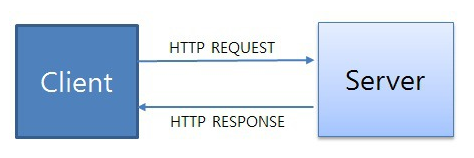
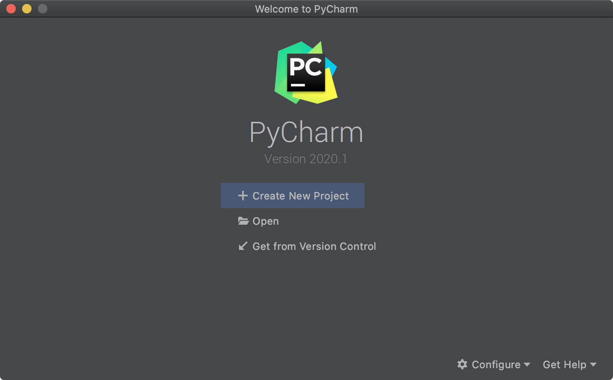
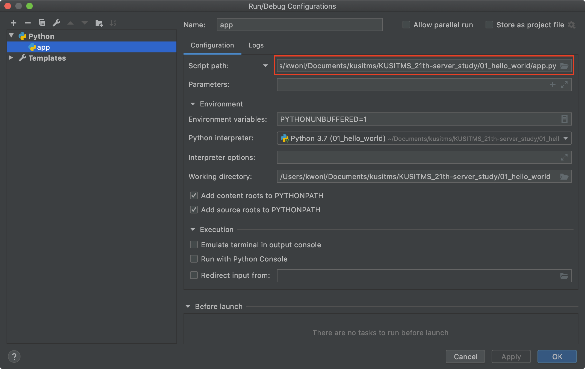
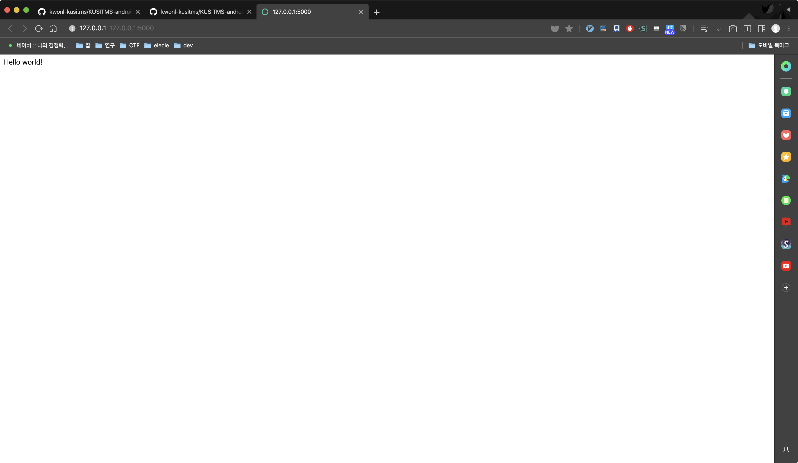

# 안드로이드 - REST API 스터디 7주차
이제부터 우리는 백엔드 서버에 대해서 배워보도록 합시다! 저번 시간에 정했던 것처럼 flask라는 python framework를 사용할 것입니다. 

## 서버란 무엇인가?
서버를 그림 하나로 요약하자면 다음과 같습니다.


위 그림을 보면 알 수 있듯, 웹에서 서버란..client(웹브라우저)가 콘텐츠를 요청하면 그것을 전달해주는 친구입니다. 간단하죠? 이 때, 부가적으로 database와 소통하여 콘텐츠에 추가적인 내용물을 더해주기도 합니다. 즉 우리가 알아야 할 것은, 1. database 2. backend application 입니다. 자세한 것은 차차 배워보도록 하죠!

## 네트워킹 기초 지식
서버와 클라이언트는 당연하게도 네트워크(인터넷)을 이용하여 소통합니다. 따라서 어느정도는 네트워킹 지식이 있어야겠죠? 간단하게만 알아보도록 합시다!

### TCP/IP
컴퓨터를 공부하다보면 TCP/IP를 한번 쯤 들어봤겠죠! 둘다 protocol을 얘기하는 것인데, IP 위에서 TCP가 작동합니다. 자세한건 몰라도 되니, 다음과 같이 알고 있으면 될 것 같습니다!

1. 인터넷 상에서 내 컴퓨터의 주소를 IP로 나타낸다.
2. IP의 형식은 0~255까지의 숫자를 4번 반복하여 .으로 분리한 뒤 나타낸다. ex) 181.13.124.29
3. port라는 것이 있는데, 이는 컴퓨터 내에서의 routing을 담당한다. port는 양의 정수로 할당된다.
4. 즉, 내 컴퓨터까지 찾아오기 까지는 IP를 사용하고, 내 컴퓨터에서 어떤 프로세스(프로그램)을 찾아갈 지는 port를 통해서 결정한다.

HTTP는 TCP/IP 위에서 동작합니다. 위의 지식정도는 가져가도록 합시다.

### HTTP
저번 시간에 배웠던 것을 복붙해보도록 합시다.

HTTP란 HyperText Transfer Protocol의 약자로, 웹 페이지 통신을 위해 만들어진 프로토콜입니다. 기본적으로는 html을 주고받기 위해 만들어진 프로토콜이지만, 근래에는 앱과 서버의 통신 등 여러 곳에서 사용되고 있습니다. 간단하게 표현하면 아래 그림과 같습니다!



HTTP message는 크게 header와 body로 이루어져 있습니다. header의 경우 통신에 필요한 부가적인 정보(meta info)가 들어 있고, body의 경우 당연히 내용물이 들어있게 되겠죠?

request의 경우 다음과 같이 구성됩니다.

1. URL
2. method
   - GET: html 페이지를 얻어오기 위한 method
   - POST: 서버에 데이터를 전달하기 위한 method
   - DELETE
   - PUT
   - PATCH
   - etc.

즉, 예를 들어 google 페이지를 요청하기 위해서는 `GET https://google.com` 이런 식이 되는 것이죠! 물론 message가 저렇게 생긴 것은 아니지만, 대략적으로 그렇다고 생각하면 될 것 같습니다.

#### Domain & URL
HTTP는 URL을 이용하여 서버를 찾는다고 했죠? 그런데 서버를 찾아가려면 IP가 필요하다고 했습니다. 이게 어떻게 된 일일까요?

DNS라는 서버가 이를 해결해줍니다. 자세히 설명은 안하겠지만, 이 DNS라는 친구가 google.com과 같은 domain을 IP로 바꿔줍니다. 우리는 **something magic happen**이라고만 생각하고 넘어가도록 하죠! 어쨌든 통상적으로 HTTP는 80번 포트를 사용합니다. HTTP에서 URL을 표시할 때, port는 다음과 같이 `:` 뒤에 숫자를 넣어주면서 표시해줄 수 있습니다. 예를 들어 살펴보도록 합시다.

```HTTP
GET https://my-api.com:8080/users
```

위 HTTP request를 해석해보자면, GET이라는 method를 통해 content를 가져오는 것이고, https는 protocol을 나타내며, `my-api.com` 이라는 도메인을 가진 서버의 8080번 포트에 `/users` 를 요청하는 것이 됩니다. `/users` 라는 부분은 path가 되는데, 이 path는 서버가 HTTP request를 받았을 때 어떤 방식으로 처리할 지를 결정하도록 도와줍니다.

즉, 서버 입장에서는 `https://my-api.com:8080` 부분은 일단 나에게 찾아오도록 정보를 제공했으니 필요가 없어지고, 이후에 따라오는 `/users`를 통해서 어떤 처리를 할지 유추하게 되죠. 폴더를 들어가는 것과 같다고 생각하시면 편합니다!

## Now, let's start flask!
서론이 길었죠.. 이제 본격적으로 flask를 배워보도록 합시다!

### Pycharm
> [python 설치 가이드](https://wikidocs.net/8)

> [pycharm 설치 가이드](https://inpages.tistory.com/99)

python 코딩을 위한 IDE로는 pycharm을 사용하기로 했습니다. pycharm은 널리 쓰이는 python IDE이므로..배워두면 편리할 겁니다.

먼저 python을 설치하시고(이 때, `Add Python 3.7 to PATH`를 꼭 체크해주세요! 설치 가이드에서 빨간색 네모를 친 부분을 잘..체크하세요) pycharm을 설치하셔야 합니다. anaconda를 설치하셨다면 python 설치는 넘어가도 될 겁니다.

모두 설치해오셨겠죠? (제가 잊지 않고 공지를 한다면 말이죠..) 기존에 anaconda를 사용하셔도 상관 없고, 아무것도 사용하지 않았어도 상관 없습니다! pycharm은 모두 지원해줍니다!

### 가상환경
python에서는 package를 설치하여 이용하게 되는데, 이러한 package는 각각 버전을 가지고 있습니다. 그리고 흔히 알려진 pip를 이용해서 설치할 수 있죠! 그런데, 프로젝트마다 사용하는 package가 다르고 버전도 다르므로 각각의 프로젝트마다 package를 분리할 수 있도록 해주는 작업이 필요합니다. 이것을 바로 virtual environment라고 합니다. 자세한건 몰라도 됩니다만, 그냥 모든 프로젝트마다 별개의 가상환경을 설정해주는 것이 좋다는 것 정도만 알아둡시다! 다음과 같은 tool로 venv를 관리할 수 있습니다.

1. python venv
2. anaconda
3. pyenv
4. pipenv

pycharm에서는 python에서 기본적으로 제공해주는 venv를 이용하여 가상환경을 관리하도록 합시다.

### Make project
pycharm을 실행시키면 다음과 같은 화면이 나올 겁니다.



어디서 많이 보던 화면이죠? 맞습니다. 안드로이드 스튜디오와 비슷하네요? pycharm은 android studio의 기반이 되는 Intellij IDEA를 만든 Jet brains에서 제작한 python용 IDE입니다. Intellij가 java용이었다면.. 따라서 매우 익숙할 것입니다.

위 화면에서, `Create New Project`를 눌러 새로운 프로젝트를 만들어줍시다.


이후에 다음과 같이 프로젝트 경로를 지정해주고, 가상환경을 셋팅해줍시다. 빨간 네모를 친 Virtualenv가 가상환경을 설정해주는 것인데, anaconda를 설치하신 분들은 conda를 사용하셔도 괜찮지만, 기본 python venv를 사용하셔도 무방합니다. conda에 대해서 딱히 설명하지는 않겠습니다.

이후 프로젝트 설정이 끝나면 다음과 같이 화면이 나타납니다.


아직 아무런 것도 만들지 않았는데, project에 venv라는 폴더가 있네요? 이것이 바로 가상환경을 저장하는 폴더입니다.

### Run configuration
자, python에서는 모든 파일이 runnable하기때문에 어떤 파일을 run할 것인지 지정해줘야 합니다. 우측 상단에 있는 `Add Configuration`을 클릭해줍시다.


이후, 그림과 같이 +버튼에 python을 눌러 다음과 같이 설정해줍시다.



이 때, Script path는 여러분이 탐색기를 통해 방금 만든 app.py를 찾아 설정해주도록 합시다. 이제 이전과 같이 오른쪽 상단의 초록색 화살표(run)을 클릭해주면 성공적으로 실행되는 것을 확인할 수 있습니다.

### Hello world!
이제 바로 새로운 파일을 만들어보도록 합시다. 새로운 파일을 만드는 건 어렵지 않죠? 이전에 했던 것과 같습니다. project에서 `우클릭->New->File`을 하거나, `ctrl + n`을 통해 바로 새로운 파일을 만들 수도 있습니다.

New file로 해서 `app.py`로 이름을 지정해주거나, New Python로 해서 이름을 `app`으로 지정해줘도 됩니다. 아무튼 `app.py`를 프로젝트 루트 directory에 새로 만들어줍시다.

그리고 다음의 코드를 입력해줍시다.

```python
from flask import Flask
```

이 코드의 의미는.. flask라는 package에서 Flask라는 친구를 사용하겠다고 하는 것과 같습니다. Java에서 잘 보면 `import com.android...` 이런 코드가 있었죠? C에서는 `#include <stdio.h>` 이것과 비슷하다고 생각하시면 됩니다.

아무튼 그렇게 입력하면 다음과 같이 에러가 표시될 겁니다.


익숙한 빨간 줄이죠? flask package를 install하지 않아 생기는 문제입니다. 해결법은 다음과 같습니다.

1. Pycharm을 이용한 auto import

   저 flask라는 곳에 커서를 올리고,, 저 이거 맨날 헷갈리는데.. `ctrl + Enter` 또는 `alt + Enter`를 눌러줍시다. 그리고 `install package flask`를 클릭해줍니다. 그러면 잠시 후에 package 설치가 끝나고, 오류가 사라집니다.

2. pip를 이용한 install

   하단에 `Terminal`이라는 메뉴가 보이죠? 클릭하여 terminal을 실행시킨 뒤, 다음과 같이 설치해줍시다.

   ```bash
   pip install flask
   ```

두 번째 방법을 더 추천드리기는 합니다! 앞으로 cli와 익숙해지셔야 합니다 ㅎㅎ

다음의 코드를 입력 해봅시다!

```python
# app.py
from flask import Flask


app = Flask(__name__)


@app.route("/")
def index():
    return "Hello world!"


if __name__ == "__main__":
    app.run()
```

제가 맨 첫줄에는 항상 파일의 path를 적어드리고 있죠? 맨 첫줄은 굳이 복붙하지 않으셔도 됩니다.

조금의 설명을 붙이자면, Flask app을 새로 만들어서 `@app.route` decorator로 **/** 라는 path에 대해서(이 경우 root path겠죠?) 어떤 처리를 할지 정의해주는 것입니다. python의 기본 문법은 넘어가도록 하겠습니다.

`if __name__ == "__main__"`: pytho은 모든 파일을 실행할 수 있습니다. 이 구문은 우리가 app.py를 메인으로, 즉, `python app.py`와 같이 실행할 때만 실행되도록 해줍니다. 그냥 main 함수를 지정해주는 것이라 생각해줍시다.

초록색 화살표를 클릭해서 run해봅시다. 다음과 같은 화면이 뜰 겁니다.


자.. `Running on http://127.0.0.1:5000/` 이것을 해석해볼까요?

우리는 지금 `python app.py`를 통해서 이 서버를 실행시킨 것과 같습니다. 이예~~ **127.0.0.1** 의 경우, IP주소인 것은 알 수 있겠죠? 이 IP주소는 특수한 IP로, localhost라고도 불립니다. 즉, 항상 자기 자신 컴퓨터를 지칭하는 IP 주소입니다. 어떤 컴퓨터에서든, 인터넷이 없는 상태에서도 127.0.0.1 을 치면 자기 자신을 가리키게 됩니다. 아까 말했듯이 **:5000**의 경우, 5000번 포트에서 서버가 돌아가고 있다는 것입니다.

아무 웹브라우저나 켜서 [http://127.0.0.1:5000/](http://127.0.0.1:5000/) 을 열어봅시다! 아니면 위의 그림에서 파란색으로 밑줄 친 곳을 `ctrl + 좌클릭`하여 기본 브라우저에서 열 수도 있습니다.



hooray!! 첫 사이트를 만들어봤습니다! 코드와 내용을 보면 우리가 예상할 수 있듯, 단순히 `GET /` 에 대해서 **"Hello world!"** 라는 내용을 return하는 것입니다.

어찌 되었든, 우리는 첫 백엔드 서버를 만들어보였습니다!
